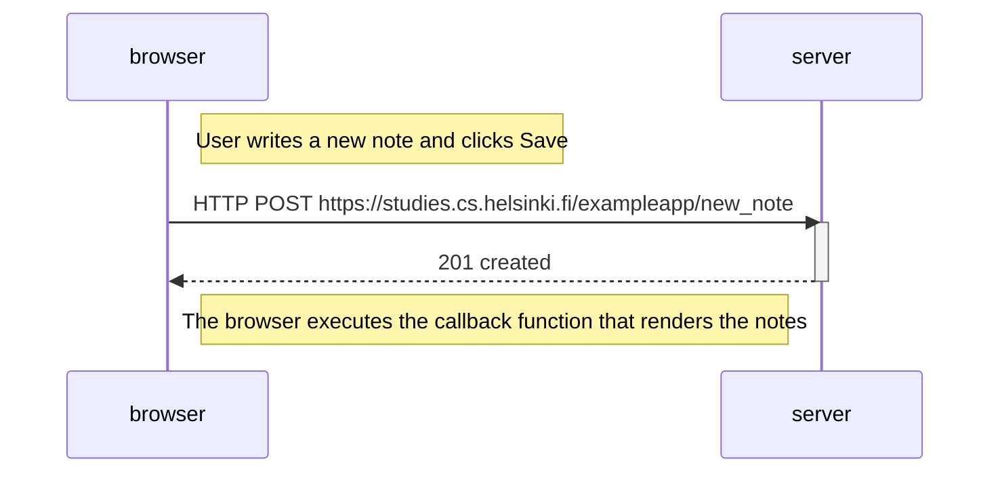

```mermaid
sequenceDiagram

    participant browser
    participant server

    Note right of browser: User writes a new note and clicks Save

    browser->>server: HTTP POST https://studies.cs.helsinki.fi/exampleapp/new_note
    activate server
    server-->>browser: 201 created
    deactivate server

    Note right of browser: The browser executes the callback function that renders the notes
```
